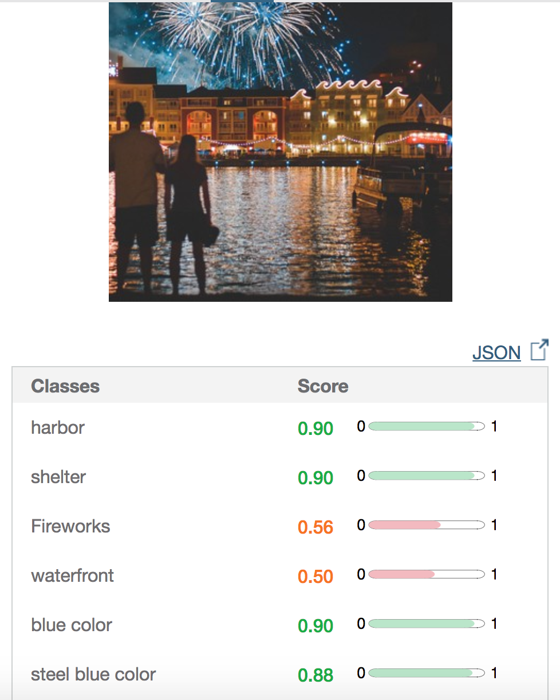

  <h1 style="border:none">IbmWaston</h1>
   
   
   

## :Summary:
- IbmWaston App is a Swift application with an iOS front end and a python flask back end. You can use this app to analyze the objects in your camera view in real time and recognize people's emotion and facial expression if a human face is detected.
- You can send chat to your friends to share weekend plan and your friend can hear the text you typed automatically.

##  Key Features
1. Sentiment Analysis
2. Images Recognition
3. Text to Speech Conversion

##  How To Use
To clone and run this application, you need to install [Swift 4](https://developer.apple.com/library/content/documentation/Swift/Conceptual/Swift_Programming_Language/GuidedTour.html), [Xcode 9](https://developer.apple.com/xcode/downloads/), and then open the xcode project and run the simulator, enjoy!

## Technology Used
- Watson Developer Cloud's iOS SDKs
- Swift 4
- Python Flask
- Mongo DB
- Carthage
- Filemanager System
